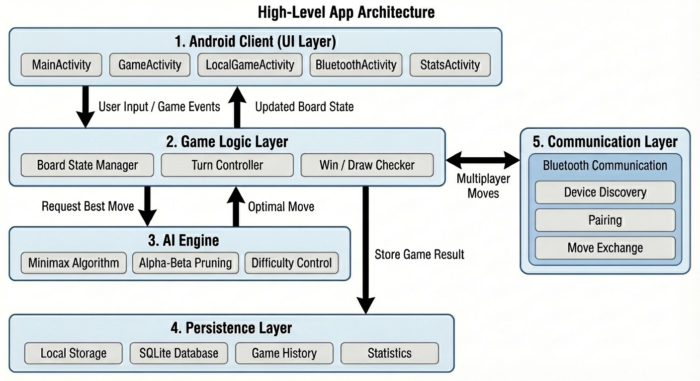
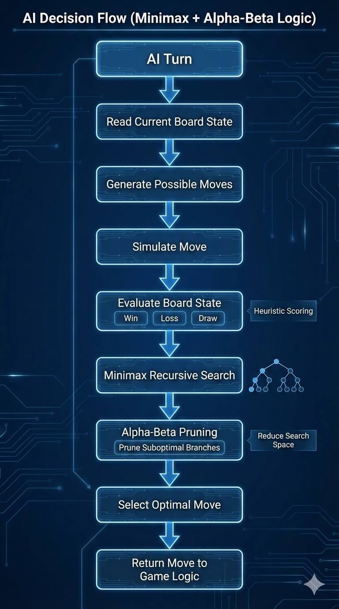

# AI-Driven Tic-Tac-Toe Mobile Application (Android)

This repository documents the architecture, design, and validation of an Android-based Tic-Tac-Toe application supporting AI gameplay, local multiplayer, and Bluetooth-based peer-to-peer play.

The project emphasizes game AI design, Android application architecture, persistent state management, and multi-mode interaction flows.

> **Note**  
> This repository contains design documentation, architecture diagrams, and visual demonstrations only. Source code is intentionally excluded to comply with academic integrity policies.

---

## Project Overview

The application supports three gameplay modes:

- **Human vs AI** with configurable difficulty levels
- **Local 2-Player** gameplay on a single device
- **Bluetooth Multiplayer** for peer-to-peer games

Additional features include persistent game history, statistics tracking, and deterministic game state management.

---

## Key Features

- AI opponent implemented using **Minimax with Alpha-Beta pruning**
- Difficulty control via search depth limitation
- Bluetooth-based multiplayer with device discovery and pairing
- Local persistence using **SQLite**
- Multi-screen Android navigation without app restarts

---

## Architecture Overview

### User Interaction Flow

### High-Level App Architecture

### AI Decision Flow

---

## Visual Demonstrations

Screenshots of core application flows are available in the `visuals/` directory, including:

- AI gameplay (easy & hard)
- Bluetooth pairing and multiplayer
- Game over dialogs
- Game history and statistics
- Home menu navigation

---

## Design Documentation

Detailed design explanations are available in the `design/` directory:

- Game logic and state management
- AI decision-making
- UI navigation and activity transitions
- Database schema and persistence logic

---

## Validation & Testing

- Gameplay logic validated via emulator-based testing
- Deterministic win/draw detection across all modes
- AI behavior verified across difficulty levels
- Bluetooth multiplayer tested using paired emulators

See `results/validation-summary.md` for details.

---

## Technologies Used

- Android SDK (Kotlin)
- SQLite
- Minimax + Alpha-Beta Pruning
- Bluetooth APIs
- Android Emulator

---

## Academic Integrity

This project was completed as part of graduate-level coursework.  
All source code and implementation artifacts are intentionally excluded to prevent reuse and maintain academic integrity.
